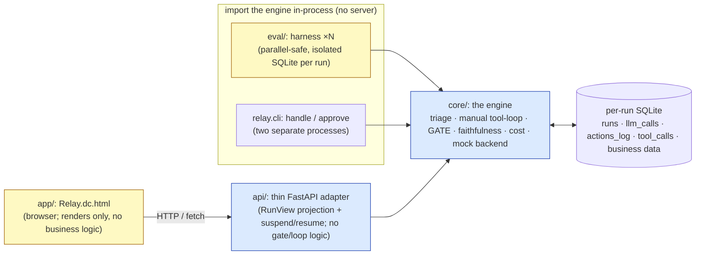
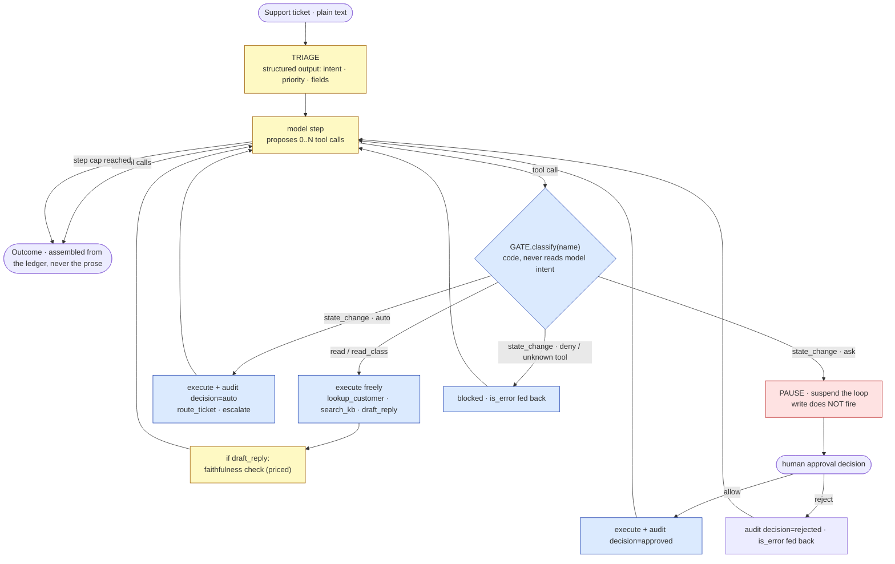
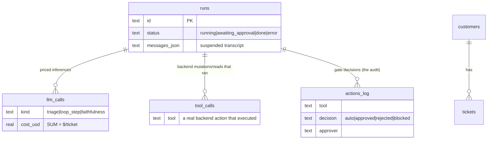
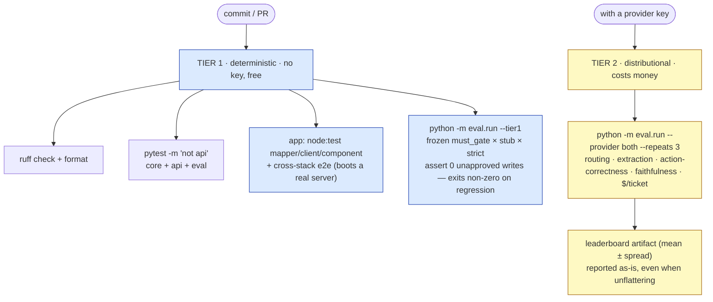
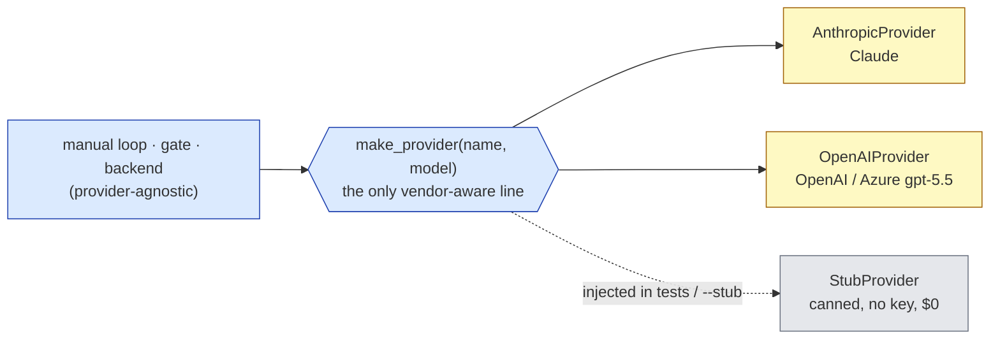

# Architecture

How Relay is wired, and why the wiring is the safety story. For the *idea* behind it, read
[the writeup](writeup.md); for the numbers, read the [leaderboard](../README.md#leaderboard-from-a-real-run).

Throughout, one legend holds:

> 🟦 **deterministic** (code, gated, must be 100%) · 🟨 **LLM** (distributional, never gated) · 🟥 **safety short-circuit** (the write that does not fire).

The whole design is the boundary between the blue and the yellow: **the model proposes, the code
decides.** Quality lives in the yellow and is reported as a mean ± spread. Safety lives in the blue
and is asserted in tests. No yellow box can ever change a blue decision.

---

## The four layers

`core/` is a plain importable Python package (the `relay` engine). **Everything imports it directly.
There is no service-to-service HTTP between Python components** — the one HTTP hop in the whole
system is the browser, which cannot import a Python module.



- **`core/`** — the engine, an installable `relay` package. Triage, the manual tool-use loop, the
  gate, faithfulness, cost accounting, and a mock SQLite backend. Knows nothing about HTTP or UI.
  *Depends on: nothing.*
- **`api/`** — a thin FastAPI adapter. Serializes the engine's `Outcome` to a `RunView` over HTTP
  and solves suspend/resume across two requests (`/handle` then `/approve`). The "no safety/model
  logic in `api/`" rule is load-bearing: the adapter only reshapes what the engine already produced.
  *Depends on: core.*
- **`app/`** — the frontend, a high-fidelity browser prototype wired to the live API. Renders the
  `RunView` and handles approval interaction; holds no business logic. The pause is real, over HTTP.
  *Depends on: api.*
- **`eval/`** — the offline eval harness. Imports `relay` directly (no server) and produces the
  leaderboard plus the deterministic safety tier. *Depends on: core.*

`eval/` and the CLI **import `core` in-process.** That is what makes eval runs isolated and
parallel-safe: each `handle()` gets its **own fresh seeded SQLite database**, and the orchestrator
is **stateless per turn** (load state → run → save), so the parallel eval pool never races on a
shared file. The browser is the one component that talks over HTTP, through `api/`, and `api/` is a
*thin adapter* — the principle that no HTTP exists where it matters keeps evals parallel-safe.

---

## The request lifecycle: triage → loop → gate

One ticket flows through triage (one LLM call), then a **bounded manual tool-use loop** (≤6 tool
calls). Every tool the model proposes is classified by the **gate** — pure code keyed by the tool's
name — *before* it can execute.



Two load-bearing choices live in this picture:

1. **A manual tool-use loop, never the SDK's auto tool-runner.** Human-in-the-loop approval requires
   intercepting each tool call *before* execution; the auto-runner would fire the tool for you. The
   loop is in [`core/src/relay/agent.py`](../core/src/relay/agent.py) (`_drive`).
2. **The Outcome is assembled from the ledger, never the model's prose.** `actions_taken` is read
   back from the `actions_log` table; `cost_usd` is `SUM(llm_calls.cost_usd)`. The model's text never
   becomes an authoritative claim about what happened.

---

## The gate: the safety contract

The gate is **pure code** ([`core/src/relay/gate.py`](../core/src/relay/gate.py)). `classify()` is a
function of two things only — the tool's class (a code constant in
[`TOOL_CLASS`](../core/src/relay/tools.py)) and a per-tool policy map. **No path exists by which
model output downgrades a `state_change` tool out of `ask`/`deny`** (*monotonic safety*). That is the
property the never-acts-without-approval invariant rests on.

| Tool class | Examples | Gate action | Notes |
|---|---|---|---|
| `read` | `lookup_customer`, `search_kb` | **EXECUTE** | policy never consulted |
| `read_class` | `draft_reply` | **EXECUTE** | composes text, writes nothing |
| `state_change` + `auto` | `route_ticket`, `escalate` (default) | **EXECUTE** + audit `auto` | |
| `state_change` + `ask` | `send_reply`, `update_ticket` (default) | **PAUSE** → `ApprovalRequest` | the 🟥 short-circuit |
| `state_change` + `deny` | any, via override | **BLOCK** | `is_error` fed back to the model |
| *unknown tool* | — | **BLOCK** | never execute what the gate can't classify |

Three presets ship: `default` (the table above), `auto` (every state-change auto-executes, still
audited), and `strict` (every state-change pauses). Per-tool `deny` overrides hard-block a tool
regardless of preset. The default for any *unlisted* state-change tool is `ask` — the gate biases
toward pausing.

---

## Suspend and resume across two processes

`ask` doesn't reject a write — it **suspends the run**. Because `handle()` and `approve()` are two
separate process invocations in the CLI (and two separate HTTP requests through the API), the
in-flight transcript must survive between them. It does: the orchestrator persists the full tool-use
transcript, the results already computed that turn, and the pending calls to a **durable, run_id-
addressable file DB** (`<state_dir>/runs/<run_id>.db`). `approve()` reopens it by id and resumes the
exact same loop.

```mermaid
sequenceDiagram
    participant U as Caller (CLI / browser)
    participant API as api/ (adapter)
    participant E as core/ engine
    participant DB as per-run SQLite

    U->>API: POST /handle {ticket, policy}
    API->>E: relay.handle(...)
    E->>E: triage + manual loop
    E->>DB: reads/blocks executed this turn (audited)
    Note over E: gate hits state_change · ask
    E->>DB: persist transcript + pending + partial results<br/>status = awaiting_approval
    E-->>API: Outcome(status=awaiting_approval, actions_pending[])
    API-->>U: RunView — the gate sheet rises, NO write yet

    U->>API: POST /approve {run_id, decisions[]}
    API->>E: relay.approve(run_id, decisions)
    E->>DB: reopen run by id, reload exact state
    Note over E: every tool_use needs a tool_result;<br/>turn-granular — all pending must be decided
    E->>DB: allow → execute write + audit decision=approved
    E->>E: resume the loop from where it paused
    E-->>API: Outcome(status=done, actions_taken[])
    API-->>U: RunView — write committed, $/ticket settles
```

The gate is **turn-granular**: if a single turn proposes more than one state-change, `approve()`
requires a decision for *every* pending action before it will resume (a partial batch is refused),
because every `tool_use` block must get a matching `tool_result` before the API will continue.

---

## The ledger and the invariant

Each run gets its own SQLite database, seeded fresh. Four tables carry the run state and the audit
trail; the rest is the mock business backend.



The two ledgers do two different honest jobs:

- **`llm_calls` is the cost ledger.** One row per model inference (triage, each loop step, each
  faithfulness check). `$/ticket = SUM(cost_usd)`. Tool execution against SQLite costs zero tokens,
  so it is deliberately *not* priced here.
- **`actions_log` is the safety ledger,** and it is where the invariant is checked:

> **No `state_change` execution row in `tool_calls` may exist without a matching `actions_log`
> decision row in `{auto, approved}`.**

That is `assert_no_unapproved_writes()` ([agent.py](../core/src/relay/agent.py)). A `rejected` or
`blocked` action leaves *no* `tool_calls` row at all (the write never ran), so the check holds for it
implicitly. This `assert` is the contract — it runs on a frozen scenario set, with a stubbed
provider, no API key, for free, on every commit.

---

## Two-tier verification: it is structurally impossible to gate a commit on an LLM number

The headline honesty mechanism. Verification splits into two tiers that never mix: a **deterministic
tier** that must be 100% and a build can be gated on, and a **distributional tier** that needs a key,
costs money, and is reported as a mean ± spread — never as a pass/fail bar.



The whole Tier-1 column runs with **no API key**: the engine accepts an injected `StubProvider`
(via the private `_provider` seam on `handle`/`approve`), so the safety invariant, the gate-policy
checks, and the cross-stack e2e all run deterministically and for free. Tier 2 needs a key and is
where the quality numbers come from — and they are reported with their spread, including the weak
ones. There is no command that turns a Tier-2 LLM number into a build gate. That separation is the
point: **you cannot make the build pass by tuning the model, and you cannot make it fail by a wobble
in a distributional metric.**

Run them locally:

```bash
make test                                       # Tier 1: all no-key suites (core, api, eval, app)
cd app && npm run e2e                            # Tier 1: the cross-stack invariant proof
python -m eval.run --tier1                       # Tier 1: the deterministic safety gate only
python -m eval.run --provider both --repeats 3   # Tier 2: the full distributional leaderboard (needs a key)
```

---

## The provider seam

Provider portability is one constructor. `make_provider("anthropic" | "openai", model)`
([agent.py](../core/src/relay/agent.py)) is the *only* place that knows which vendor it got;
nothing downstream — the gate, the loop, the backend, faithfulness, the `Outcome` — can tell.
Both providers emit the **same provider-agnostic tool schema** (non-strict tool calling, with native
strict structured outputs reserved for the triage call), so a second column drops into the
leaderboard with nothing more than a key. The `StubProvider` is never built by `make_provider`;
tests and the offline demo inject it directly through the `_provider` seam, which is exactly what
keeps Tier 1 keyless.


